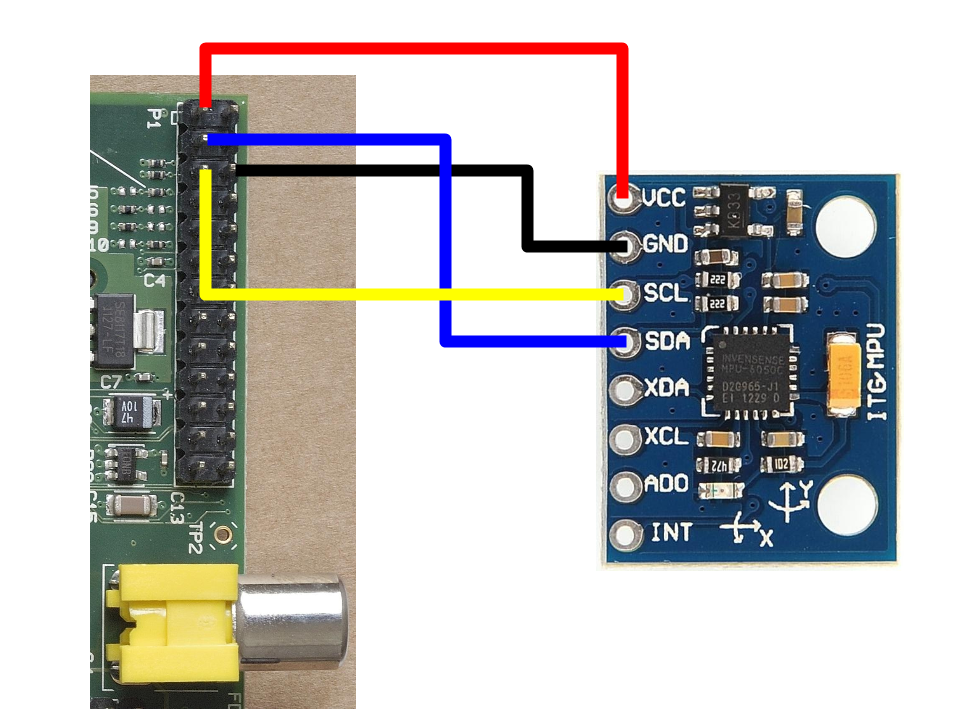

# IMU (MPU9255 9 DOF)

Interfacing Raspberry Pi with MPU9255:



## Installation

### [RTIMULib2](https://github.com/RoboticaUtnFrba/RTIMULib2)

Go to the RTIMULib2 directory and compile it:

```
$ cd Linux
$ mkdir build
$ cd build
$ cmake ..
$ make -j4
$ sudo make install
$ sudo ldconfig
```

## [Calibrate IMU](https://github.com/RoboticaUtnFrba/RTIMULib2/blob/master/Calibration.pdf)

The normal process is to run the magnetometer min/max option followed by the magnetometer ellipsoid fit option followed finally by the accelerometer min/max option.

The resulting RTIMULib.ini can then be used by any other RTIMULib application.

```sh
$ RTIMULibCal
```

### Calibrating the magnetometer

[This video](https://www.youtube.com/watch?v=-Uq7AmSAjt8) shows how to wag your IMU in order to calibrate the magnetometer.

### Calibrating the accelerometer

[This video](https://www.youtube.com/watch?v=CnLtzwCbVc4) shows how the calibration process of the accelerometer has to be made.

## [i2c_imu ROS package](https://github.com/RoboticaUtnFrba/i2c_imu)

```
$ cd catkin_ws/src
$ git clone git@github.com:RoboticaUtnFrba/i2c_imu.git
```

### Running

```
$ roslaunch ca_imu imu.launch
$ rviz
```